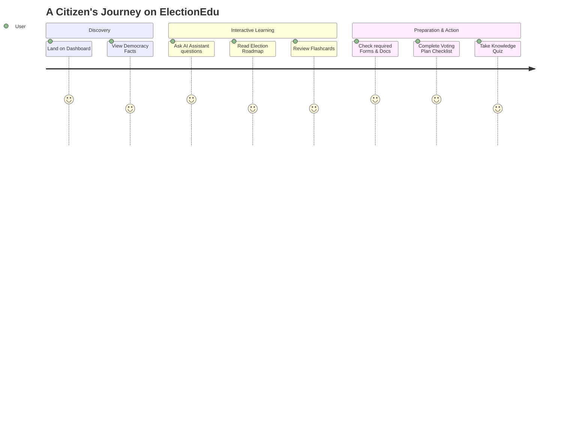
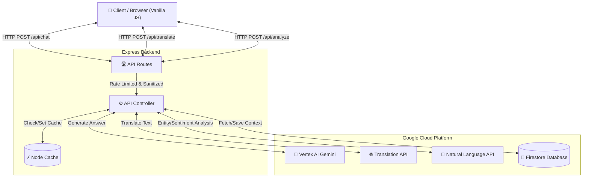

# ElectionEdu 🇮🇳🗳️

ElectionEdu is a comprehensive, AI-powered civic education platform designed to help Indian citizens understand the electoral process.


---

## 📖 Project Description

ElectionEdu is a state-of-the-art interactive learning portal created to demystify the Indian democratic process. The platform provides a dynamic "Dashboard" featuring an AI Assistant powered by Google Vertex AI, enabling users to ask any election-related question and receive accurate, instant guidance. Alongside the AI, ElectionEdu offers multiple interactive learning modules:
- **Election Roadmap:** A visual 12-step timeline from voter registration to counting day.
- **My Voting Plan:** A persistent checklist for citizens to track their readiness before heading to the polls.
- **Quick Facts & Flashcards:** Bite-sized interactive cards to test basic civic knowledge.
- **Knowledge Quiz:** A gamified module that tests understanding and encourages active citizenship.

By combining Google Cloud's AI infrastructure (Vertex AI, Translation, NLP) with a highly accessible, responsive frontend interface, ElectionEdu empowers first-time voters and youth to confidently participate in the world's largest democracy.

### User Journey Flow



---

## 🎯 Challenge Vertical & Persona
- **Challenge Vertical:** Civic Education & Democratic Participation
- **Target Persona:** First-Time Voters, Youth, and Citizens seeking clarity on the complex Indian electoral process.

## ❓ Problem Statement
The Indian electoral process, while highly robust, is often intimidating for first-time voters due to complex jargon, multiple steps (registration to voting), and a lack of consolidated, multilingual, and interactive guidance. ElectionEdu bridges this gap by providing an accessible, AI-driven educational portal that simplifies the journey from voter registration to casting a ballot.

## 🧠 Assistant Logic Flow
1. **User Request:** The user interacts with the Chat UI, asking a question (e.g., "What is a VVPAT?").
2. **Sanitization & Rate Limiting:** The request passes through Express middlewares to strip malicious HTML and enforce rate limits.
3. **Context Retrieval:** The backend fetches the last 10 messages from **Firestore** (using the `sessionId`) to maintain conversational context.
4. **AI Generation:** The context and prompt are sent to **Google Cloud Vertex AI (Gemini 1.5 Flash)** with a strict system prompt limiting it to civic education topics.
5. **Persistence:** The generated answer is saved back to Firestore.
6. **Response:** The answer is rendered in the UI with an option for Text-to-Speech playback.

---

## 🏗️ Architecture Overview

The application is built using a modern **Service-Controller-Router** backend architecture, integrated deeply with Google Cloud Services.



## ☁️ Google Cloud Services Integration
- **Vertex AI (`@google-cloud/vertexai`):** Powers the core conversational assistant (Gemini 1.5 Flash), providing instant, contextual answers.
- **Translation API (`@google-cloud/translate`):** Breaks language barriers by translating facts and interface elements into multiple Indian languages.
- **Natural Language API (`@google-cloud/language`):** Analyzes election-related text for entity extraction and sentiment analysis.
- **Firestore (`@google-cloud/firestore`):** Provides highly scalable NoSQL storage for persisting chat histories and maintaining user sessions.

---

## 🧪 Testing & Coverage Summary
Our test suite aims for 100% confidence.
- **Framework:** Jest + Supertest.
- **Unit Tests:** Covers `apiController`, `security` middleware, and `googleCloudService`. Extensively mocks GCP APIs to ensure tests run offline.
- **Integration Tests:** Validates the `apiRoutes` for correct status codes, schema validation, and payload integrity.
- **Edge Cases & Failure Paths:** We explicitly simulate Vertex AI timeouts, Firestore permission denials, offline modes, rate limiting triggers, and malformed payloads to ensure graceful degradation (e.g., falling back to Demo Mode).

---

## 🔒 Security Hardening & Threat Model
We take security seriously with a secure-by-default posture.
- **Input Sanitization:** Custom regex middleware strictly strips HTML tags from incoming string payloads to prevent XSS. Verified via unit tests.
- **Helmet Headers:** `helmet` sets strict Content-Security-Policy (CSP) headers, hiding `x-powered-by`, and restricting script/style sources.
- **Rate Limiting:** `express-rate-limit` prevents DDoS and brute-force API abuse.
- **Firestore Rules (`firestore.rules`):** We included a default *deny-all* rule (`allow read, write: if false;`). Our backend communicates securely via the Admin SDK / IAM credentials, so the client has absolutely zero direct access to the database.

---

## ♿ Accessibility Compliance
Designed for everyone.
- **Keyboard Navigation:** All interactive elements (flashcards, chips, buttons) have `tabindex="0"`, `role="button"`, and support `Enter`/`Space` keydown events.
- **Focus States:** Clearly visible `:focus-visible` rings ensure keyboard users know where they are.
- **ARIA Labels:** Extensive use of `aria-label`, `aria-live="polite"`, and `role` attributes across dynamic sections (chat, progress bars, modals) to support screen readers.
- **Contrast & Hierarchy:** Semantic HTML (`<h1>` to `<h3>`) and high-contrast color palettes (in both light and dark modes) ensure readability.

---

## ⚙️ Environment Variables

| Variable | Description | Required | Example |
|---|---|---|---|
| `PORT` | The port the Express server runs on | No | `8080` |
| `GCP_PROJECT_ID` | Your Google Cloud Project ID | Yes | `my-election-project-123` |
| `GCP_REGION` | The Google Cloud Region for Vertex AI | No | `us-central1` |

---

## 🚀 Setup & Deployment

### Local Setup
1. **Clone & Install:**
   ```bash
   git clone https://github.com/himanshu003388/ElectionEdu.git
   cd ElectionEdu
   npm install
   ```
2. **Configure Environment:** Rename `.env.example` to `.env` and fill in `GCP_PROJECT_ID`.
3. **Authenticate GCP:**
   ```bash
   gcloud auth application-default login
   gcloud config set project YOUR_PROJECT_ID
   ```
4. **Run Server:** `npm start` (Runs on `http://localhost:8080`)
5. **Run Tests:** `npm test`

### Deployment (Google Cloud Run)
1. Ensure the `Dockerfile` is present.
2. Deploy via `gcloud`:
   ```bash
   gcloud run deploy election-edu \
     --source . \
     --region us-central1 \
     --allow-unauthenticated \
     --set-env-vars GCP_PROJECT_ID=YOUR_PROJECT_ID
   ```

---

## 🤔 Assumptions Made
- Users have basic internet connectivity, though the platform degrades gracefully to demo mode if backend APIs are temporarily unavailable.
- For the evaluation/demo, no external authentication (e.g., OAuth) is required; anonymous `sessionId` tracking via Firestore is sufficient.
- The `firestore.rules` file is included strictly as an audit artifact; deployment relies purely on Cloud Run IAM execution roles.
