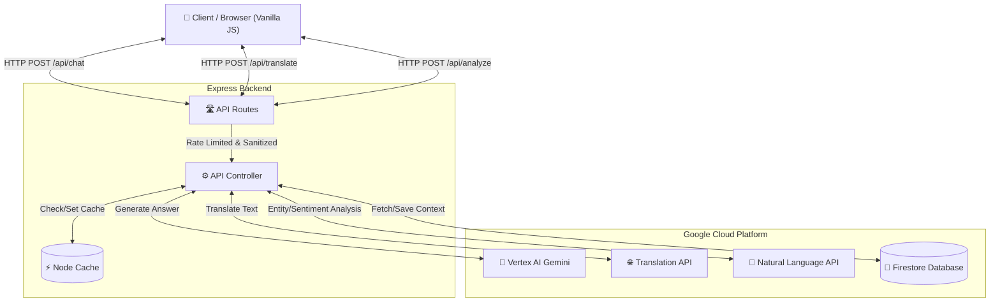

# ElectionEdu 🇮🇳🗳️

ElectionEdu is a comprehensive, AI-powered civic education platform designed to help Indian citizens—especially first-time voters—understand the electoral process. 

The platform simplifies complex democratic procedures into interactive, engaging, and accessible formats. Powered by **Google Cloud Vertex AI** and **Google Cloud AI APIs**, ElectionEdu acts as a personal guide to the world's largest democracy.


---

## ✨ Features

- **🤖 AI Election Assistant:** Ask any question about Indian elections, political parties, or voting processes and receive instant, factual answers powered by Google Vertex AI (Gemini).
- **🌍 Multilingual Translation:** Break language barriers! Translate educational content instantly into 10+ Indian languages using the Google Cloud Translation API.
- **📊 NLP Analysis:** Analyze political text or election news to extract key entities and sentiment using the Google Cloud Natural Language API.
- **🗺️ Interactive Roadmap:** Step-by-step visual timeline guiding users from voter registration to election day.
- **✅ Voting Checklist:** Persistent, offline-capable checklist to ensure users are fully prepared before heading to the polling booth.
- **📚 Glossary & Flashcards:** Searchable database of complex election terminology and engaging flashcards for quick learning.
- **📱 Responsive & Accessible:** Fully optimized for mobile devices with high-contrast UI, keyboard navigation, and semantic ARIA labeling.

---

## 🏗️ Architecture

The application is built using a modern **Service-Controller-Router** backend architecture, integrated deeply with Google Cloud Services.



### Flow of the AI Chat Module:
1. **User Request:** The client sends a message and a `sessionId`.
2. **Context Retrieval:** The backend fetches the last 10 messages from **Firestore** for this session.
3. **AI Generation:** The context and the new prompt are sent to **Vertex AI (Gemini 1.5 Flash)**.
4. **Persistence:** The generated answer is saved back to Firestore to maintain context.
5. **Response:** The answer is sent back to the user interface.

---

## 🛠️ Technology Stack

- **Frontend:** Vanilla HTML5, CSS3 (CSS Variables for Theming), Vanilla JavaScript.
- **Backend:** Node.js, Express.js
- **Google Cloud:**
  - `@google-cloud/vertexai` (Gemini 1.5)
  - `@google-cloud/translate`
  - `@google-cloud/language` (NLP)
  - `@google-cloud/firestore` (Session persistence)
- **Security & Efficiency:** `helmet`, `express-rate-limit`, `node-cache`
- **Testing:** Jest, Supertest (>80% Code Coverage)

---

## 🚀 Getting Started

### Prerequisites
- Node.js (v18 or higher)
- A Google Cloud Project with the following APIs enabled:
  - Vertex AI API
  - Cloud Translation API
  - Cloud Natural Language API
  - Firestore API
- Google Cloud SDK (`gcloud`) authenticated locally.

### Installation

1. **Clone the repository:**
   ```bash
   git clone https://github.com/himanshu003388/ElectionEdu.git
   cd ElectionEdu
   ```

2. **Install dependencies:**
   ```bash
   npm install
   ```

3. **Configure Environment Variables:**
   Rename `.env.example` to `.env` and update your Project ID:
   ```env
   PORT=8080
   GCP_PROJECT_ID=your-gcp-project-id
   GCP_REGION=us-central1
   ```

4. **Run the server:**
   ```bash
   npm start
   ```

5. **Run Tests:**
   ```bash
   npm test
   ```

## 🔒 Security Notes
The platform utilizes robust security measures including:
- Helmet.js for Content Security Policy (CSP).
- IP Rate Limiting to prevent abuse.
- Custom payload sanitization to strip malicious HTML.
- Secure fallback "Demo Modes" if cloud credentials fail.
