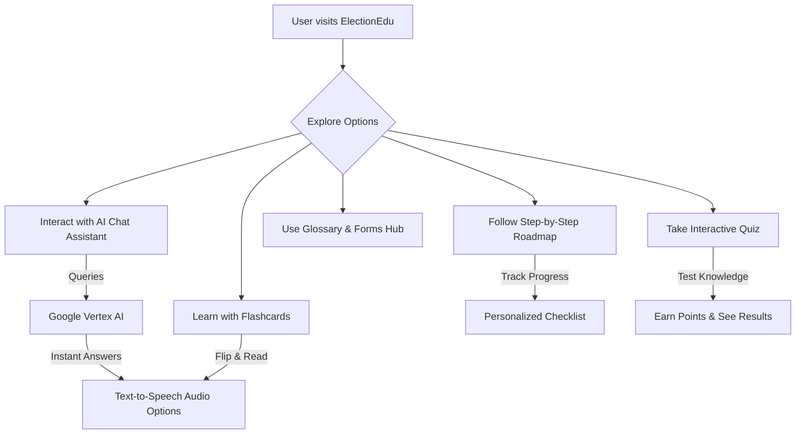
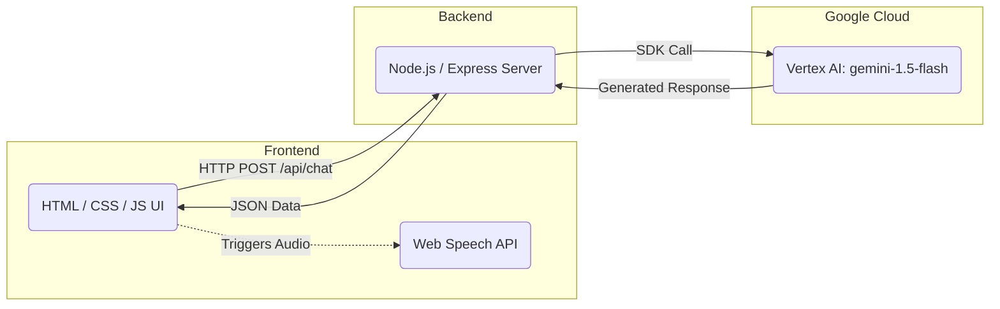

# ElectionEdu | Master the Indian Election Process

A platform where you can learn and gain knowledge about the Indian Election Process in an interactive, accessible, and engaging way.

## Description
**ElectionEdu** is a comprehensive EdTech platform designed to demystify the world's largest democratic exercise—the Indian Elections. Aimed at first-time voters, students, and citizens seeking clarity on their civic duties, the platform breaks down complex procedures like voter registration, understanding EVMs/VVPATs, and the polling process into bite-sized, gamified, and conversational modules. By combining an AI-powered Chat Assistant, interactive flashcards, a step-by-step roadmap, and an engaging quiz system, ElectionEdu transforms passive learning into active civic engagement.

## Chosen Vertical
**Education & Civic Engagement (EdTech)**
Our mission is to educate citizens on the complex, multi-stage Indian Election Process, transforming civic duty into an accessible, engaging learning experience.

## Architecture & Diagrams

### 1. User Flow Diagram
The following diagram illustrates how a user can navigate and interact with the various features of ElectionEdu:

### 2. System Architecture
The application follows a lightweight Single Page Application (SPA) architecture backed by a Node.js Express server acting as a bridge to Google Cloud Vertex AI.

## Approach & Logic
The solution is built as a Single Page Application (SPA) with a multi-view architecture:
1. **Home View:** Features a side-by-side layout with a smart Chat Assistant (powered by Google Vertex AI) and interactive Flashcards. Users can explore information conversationally or via quick bite-sized cards.
2. **Key Info Flowchart:** A visual representation of the 7 major steps of the Indian Election process (Delimitation to Results).
3. **Interactive Quiz:** A point-based quiz system designed to test and reinforce knowledge gathered from the AI and flashcards.

### Key Features
- **Google Vertex AI Integration:** A dynamic Chat Assistant powered by the `gemini-1.5-flash` model via Google Cloud Vertex AI. The prompt logic is contextually constrained to act as an expert on the Indian Election Process.
- **Audio System (Text-to-Speech):** Utilizes the Web Speech API to provide an audio-based learning experience. Users can click the speaker icon to hear the AI's response or have flashcards read aloud—improving accessibility.
- **Dark / Light Mode:** A fully responsive theme toggle to ensure readability across all environments.
- **Gamified Quiz:** Point-based system rewarding users for correct answers (10 points per question).

## How the Solution Works
- **Frontend:** Vanilla HTML, CSS, and JavaScript. Uses CSS variables for dynamic theming (Dark/Light mode). Navigation is handled via DOM manipulation to hide/show views smoothly.
- **Backend:** Node.js with Express. It serves static files and provides an `/api/chat` endpoint.
- **AI Logic:** The Express server securely integrates with `@google-cloud/vertexai`. It injects a system prompt framing the assistant as an Election Expert before passing the user's query to Gemini.
- **Accessibility:** TTS (Text-to-Speech) is dynamically attached to DOM elements. When the user interacts with the TTS button, the frontend parses the most recent AI response or the currently viewed side of the flashcard.

## Assumptions Made
- The user has configured Google Cloud credentials (`GCP_PROJECT_ID` and `GCP_REGION`) locally for Vertex AI to function correctly. The app falls back to a "Demo Mode" warning if credentials are not found.
- The browser supports the `window.speechSynthesis` API for the audio feature (supported by >95% of modern browsers).
- For the hackathon evaluation, the single branch rule and GitHub public repository constraints are followed by the submitting user.

## Setup Instructions
1. Clone this repository inside your Google Antigravity environment.
2. Run `npm install` to download dependencies.
3. Configure your `.env` file with `GCP_PROJECT_ID`.
4. Run `npm start` and visit `http://localhost:8080`.
